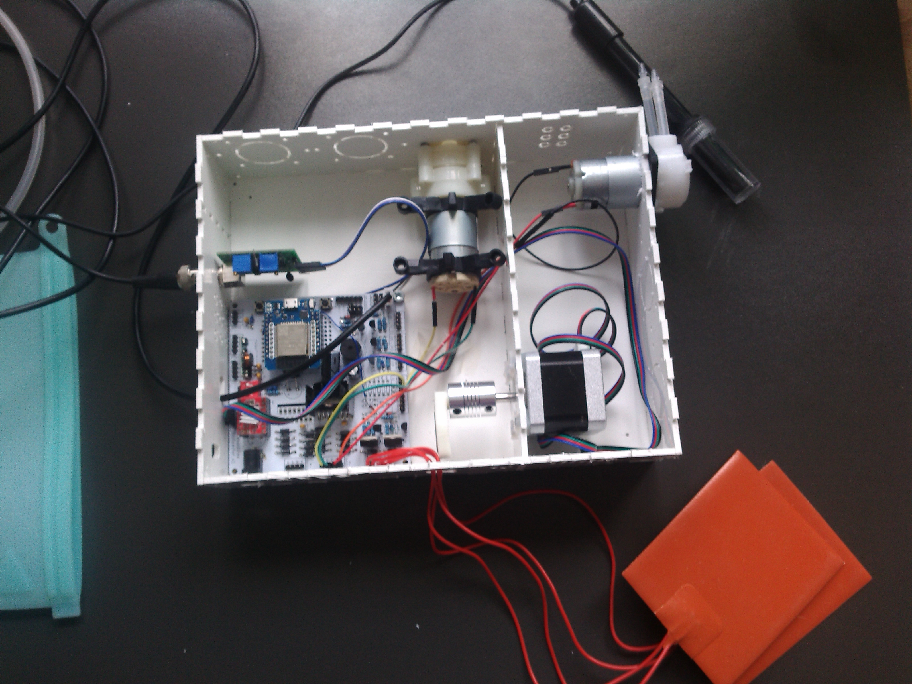

# bioreactor
Hi there! Welcome to the Bioreactor repository. While a lot of information is still stored in other repositories like Slack, Google Docs and different clouds this is pretty comprehensive and usable.

Please be aware this is work in progress and sometimes the most recent version is under the cloud storage for the specific application.

For software please look under src firmware for most of the code. You will need to use Eclipse and we have a config guide under docs.
The Blocky interpreter will be added soon and initially will be using Visual Studio but that might change.

For electronics you can find descriptive pdf files for all the boards and the corresponding schematics and PCB layouts under electronics. They don't change a lot, so most likely what you see in here is the latest stable board.

For mechanics you can find the Fusion 360 files for the main body under mechanics. Some of the smaller parts that are 3d printed are designed using Tinkercad. Newer ones are done in Fusion 360 or OpenCad as we move away from Tinkercad.

Most of the images and some videos are under docs images. Sometimes an image is worth 1000 words.

There is a boilerplate paper which highlights the generic editing yet it is is just a place to gather paper materials.

We also have a spreadsheet with the parts yet that is a little bit of a moving target as we enhance the design and experiment with newer parts.

Several folders like management-interface, server and controller contain experimental material

Below you can find a brief info about setting up the device, for other questions feel to shoot [us](https://github.com/liquidatom) a message.

## Quick Start

1. Assemble the device 
2. [Configure eclipse](https://github.com/AdrianMolecule/bioreactor/blob/master/docs/Configuring%20Eclipse%20to%20run%20ESP32.md)  
3. Build and upload firmware
4. Configure bioreactor using [this](https://github.com/AdrianMolecule/bioreactor/tree/master/docs/manual%20bioreactor%20v1.pdf) manual
5. use the ODmeter readme to install the ODMeter

