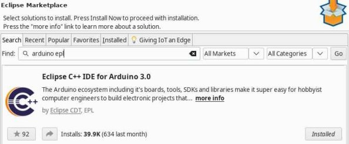
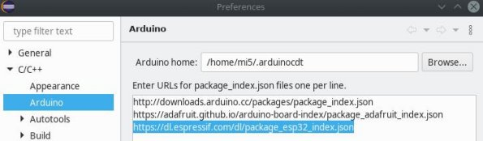
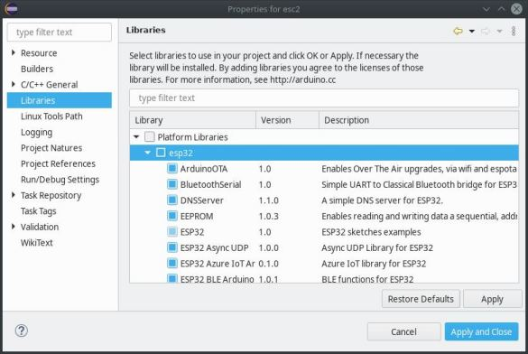

This document is about configuring Eclipse to build and run ESP32 firmware. Can be used to configure almost any arduino-like hardware, same way as you can do it in Arduino IDE.

### Prerequirements
I'm using Eclipse 4.15.0, but any with 'Eclipse Marketplace' should work.  
Also i assume your IDE already has C/C++ support, if not, you can easily upgrade it by installing **'Eclipse C/C++ IDE CDT'** plugin from market place

### Steps to run ESP application
1. Open marketplace by clicking Help->Eclipse Marketplace

2. Find and install plugin 'Eclipse C++ IDE for Arduino 3.0', version can be older.  


3. New plugin has support only for Arduino SDK, to download ESP32 sdk, you need to tell where is it located.
Open Window->Preferences, in new window choose C/C++->Arduino and enter new package url 
<https://dl.espressif.com/dl/package_esp32_index.json>  
  
If Arduino plugin version less than 3.0, this step may be different.

4. Then enable ESP32 sdk, go to Help->Arduino Downloads Manager.
Click 'Add' button on 'Platforms' tab. Choose 'esp32' from the list  


5. Then create an Arduino project, to build it, you need to define a new target  
  
Board Type: ESP32 Dev Module
Upload Speed: 115200

6. Enable all ESP32 libraries in project properties  


**Note for Linux users**

You may experience some problems during compilation
```
platform.h:39:10: error: #include expects "FILENAME" or FILENAME
#include MBEDTLS_CONFIG_FILE
```
to fix this you need to escape quotes for some predefines, since files were taken from Windows OS which works fine with double quotes.  
You need to change definitions in ~/.arduinocdt/packages/esp32/hardware/esp32/1.0.4/platform.txt  
Substitute  
```
-DMBEDTLS_CONFIG_FILE="mbedtls/esp_config.h"
-DARDUINO_VARIANT="esp32" 
```
with  
```
-DMBEDTLS_CONFIG_FILE='"mbedtls/esp_config.h"'  
-DARDUINO_VARIANT='"esp32"'
```


Now you are all set!
